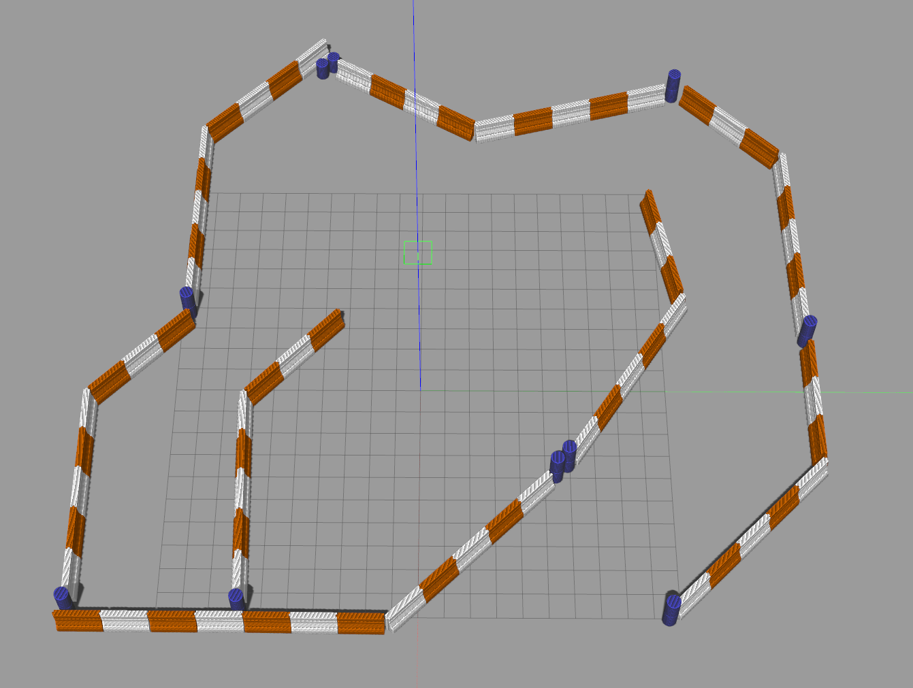
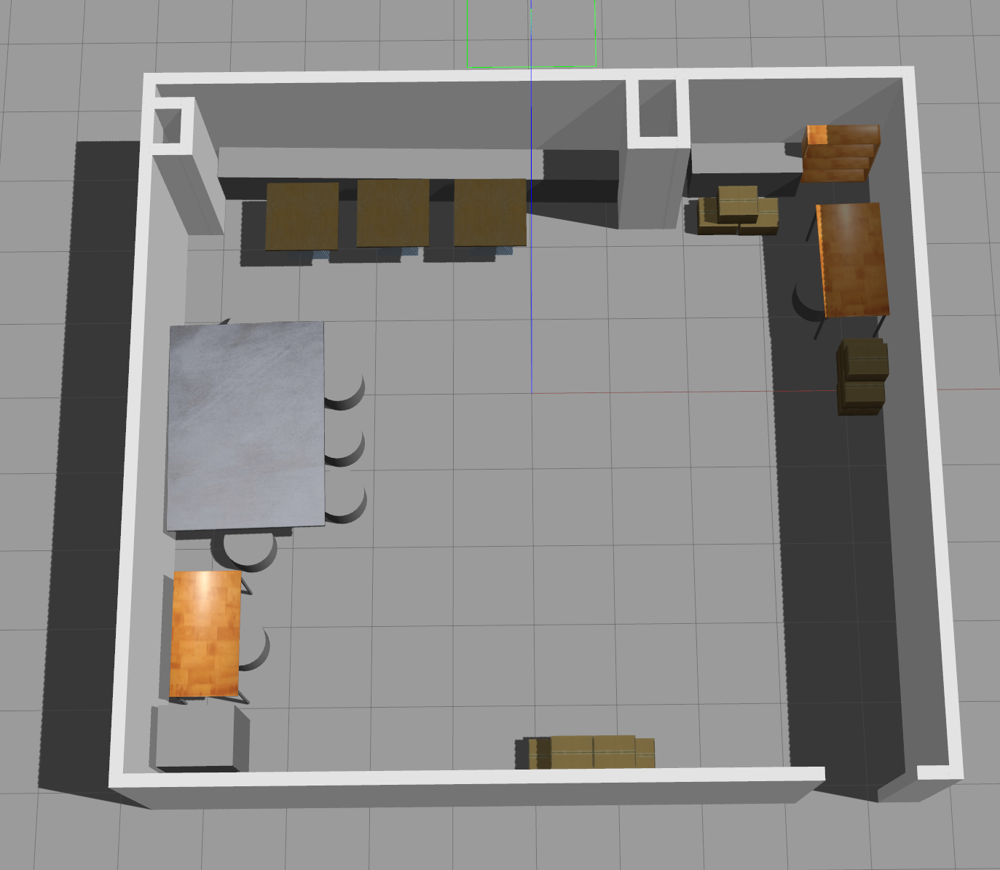
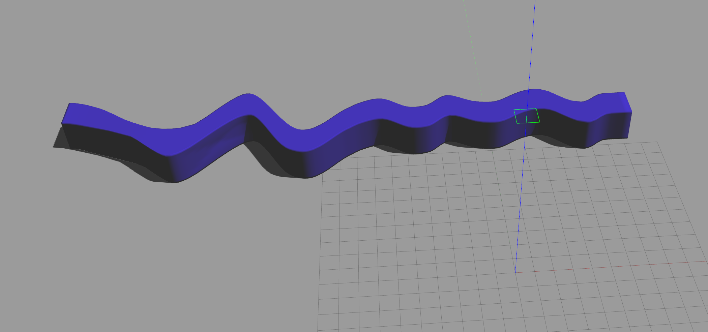
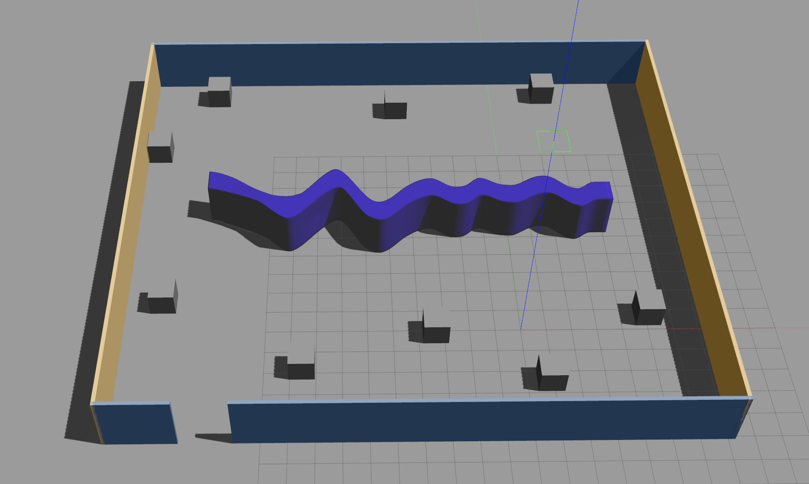
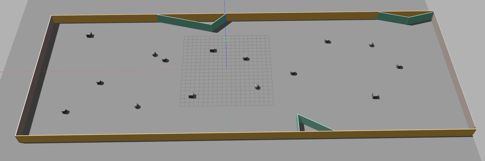

# Ridgeback Worlds 
*Refer to https://github.com/JiyooonPark/ridgeback_simulator/tree/melodic-devel/ridgeback_gazebo/worlds for the worlds*

*Tested on **Ubuntu 18.04** with **ROS Melodic**.*

## Worlds 
1. ridgeback_race



2. renew_sk



3. small_curved_wall



4. small_curved_wall_world



5. rect_room




## Demo
Run the following commands in respective terminals.

set up before run:
```sh
    rosrun gazebo_ros gazebo world_name.world_ext
```

